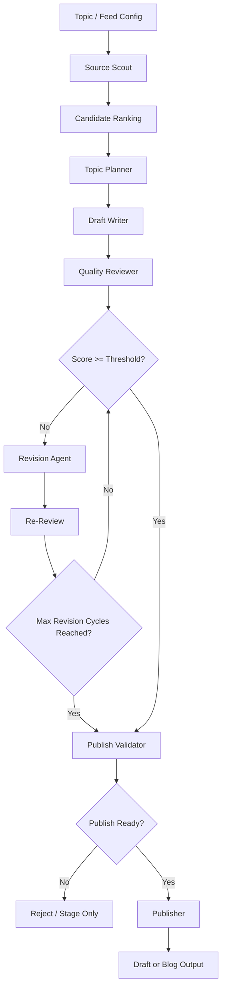

# Scafblog AI Orchestration Architecture

Scafblog uses a single orchestrator process with first-class agent roles. Agents are invoked on demand, per stage, and every stage emits structured artifacts.

## Runtime model

- One orchestrator script: `scripts/feed-to-draft.mjs`
- One agent registry: `scripts/lib/agentRuntime.mjs`
- One local execution tracker: `orchestration-state.local.json`
- One run-artifact tree: `stageArea/runs/<run-id>/`

## Agent flow

## Agent responsibilities

### Source Scout
- Pulls RSS feeds in parallel
- Filters processed entries
- Ranks candidates by keyword relevance

### Topic Planner
- Creates title direction
- Defines angle and thesis
- Produces outline, tags, risks, and must-include points

### Draft Writer
- Converts plan + source into article markdown
- Uses the plan as execution constraints

### Quality Reviewer
- Scores technical depth, clarity, originality, and structure
- Decides whether revision is mandatory

### Revision Agent
- Rewrites against structured review feedback
- Stops after `MAX_REVISION_CYCLES`

### Publish Validator
- Applies deterministic checks
- Combines local validation score with reviewer score

### Publisher
- Packages final MDX
- Writes to `stageArea/drafts/` by default
- Can write directly to `blog/` when `DIRECT_PUBLISH=true`

## Execution artifacts

Each run saves:

- `01-source.json`
- `02-plan.json`
- `03-draft.md`
- `04-review.json`
- `05-revised.md` when revision runs
- `05b-review-after-revision.json` when re-review runs
- `06-validation.json`
- `06-final.mdx`
- `07-summary.json`

## Local state

`orchestration-state.local.json` tracks:

- `runs`: final run summaries
- `events`: per-agent execution events

This file is local-only and gitignored.
